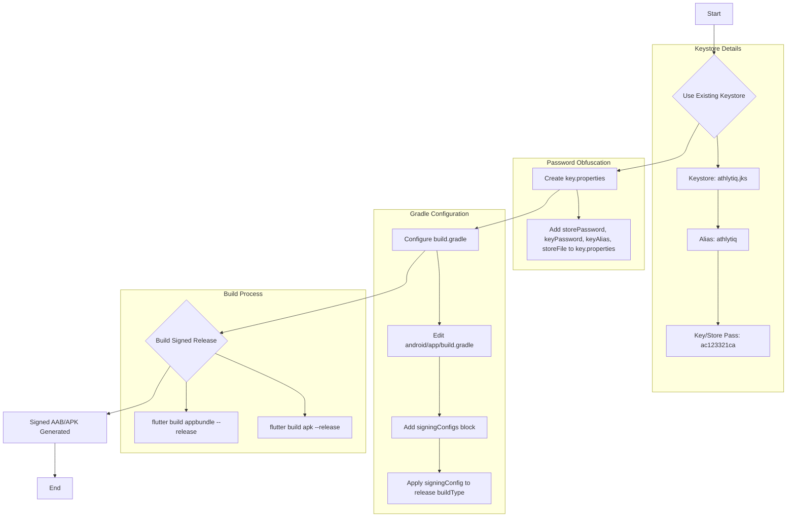

### Plan for Android App Signing and Building

This plan outlines the steps required to generate a signed Android App Bundle (AAB) or APK for your Flutter application, using your existing keystore. AABs are the recommended format for publishing to Google Play.

#### Goal: Generate a signed Android App Bundle (AAB) or APK for the Flutter project using the existing `athlytiq.jks` keystore.

#### Mermaid Diagram:



#### Detailed Steps:

**Step 1: Use Existing Keystore**

You have confirmed that you already have the keystore file `athlytiq.jks` located at `fitnation/athlytiq.jks`.
The details provided are:
*   **Keystore File:** `athlytiq.jks`
*   **Alias:** `athlytiq`
*   **Key Password:** `ac123321ca`
*   **Store Password:** `ac123321ca`

We will proceed directly to configuring your project to use this keystore.

**Step 2: Create `key.properties` for Secure Password Storage**

It's a best practice to avoid hardcoding your keystore passwords directly into your `build.gradle` file. Instead, you'll create a separate file to store them securely.

1.  **Create a new file named `key.properties` inside the `android` directory** (e.g., `fitnation/android/key.properties`).
2.  **Add the following lines to `key.properties`**, using the details you provided:
    ```properties
    storePassword=ac123321ca
    keyPassword=ac123321ca
    keyAlias=athlytiq
    storeFile=../../athlytiq.jks
    ```
    *   **Important Note on `storeFile` path**: The `key.properties` file will be in `fitnation/android/`. Your `athlytiq.jks` file is in `fitnation/`. Therefore, the relative path from `fitnation/android/` to `fitnation/athlytiq.jks` is `../../athlytiq.jks`.

**Step 3: Configure Signing in `build.gradle`**

Now, you need to tell your Android project to use the generated keystore for signing.

1.  **Open the `android/app/build.gradle` file** (relative path: `fitnation/android/app/build.gradle`).
2.  **Locate the `android { ... }` block.**
3.  **Add the following code snippet inside the `android { ... }` block**, typically before the `buildTypes` block:

    ```gradle
    // Read the key.properties file
    def keystoreProperties = new Properties()
    def keystorePropertiesFile = rootProject.file('key.properties')
    if (keystorePropertiesFile.exists()) {
        keystoreProperties.load(new FileInputStream(keystorePropertiesFile))
    }

    android {
        ...
        signingConfigs {
            release {
                storeFile file(keystoreProperties['storeFile'])
                storePassword keystoreProperties['storePassword']
                keyAlias keystoreProperties['keyAlias']
                keyPassword keystoreProperties['keyPassword']
            }
        }
        buildTypes {
            release {
                // TODO: Add your own signing config for the release build.
                // Signing with the debug keys for now, so `flutter run --release` works.
                signingConfig signingConfigs.release
                // Other release configurations...
            }
        }
    }
    ```
    *   This code reads the passwords and alias from `key.properties` and configures a `release` signing configuration.
    *   It then applies this `release` signing configuration to the `release` `buildType`.

**Step 4: Build the Signed Release Bundle or APK**

Finally, you can build your signed application.

1.  **Open your terminal or command prompt.**
2.  **Navigate to the root directory of your Flutter project.**
    ```bash
    cd fitnation
    ```
3.  **To build an Android App Bundle (AAB) (recommended for Google Play):**
    ```bash
    flutter build appbundle --release
    ```
    *   The AAB will be generated in `fitnation/build/app/outputs/bundle/release/app-release.aab`.

4.  **To build a signed APK (for direct distribution or testing):**
    ```bash
    flutter build apk --release
    ```
    *   The signed APK will be generated in `fitnation/build/app/outputs/flutter-apk/app-release.apk`.